# Введение

Это руководство объясняет, как работать с админ‑панелью MoonShine: где находится каждый раздел, что означает каждое поле, и как безопасно вносить изменения, чтобы они корректно отображались на сайте.

Админ‑панель — это интерфейс управления данными (сущностями) проекта: страницами, новостями, продуктами, формами, заявками и настройками сайта.

## Карта сущностей (что с чем связано)

Ниже — упрощённая схема, которая помогает понимать последствия изменений:

- **Pages** → основной конструктор контента страниц сайта (страницы состоят из блоков).
  - страница может быть **Static** (обычная) или **Product landing** (продуктовая, связана с продуктом).
- **Articles** ↔ **Article Categories** → новости/публикации и их категории (категории могут быть вложенными).
- **Games** ↔ **Game Categories** → игры и категории игр (используются для подборок/выводов в блоках страниц).
- **Products** → базовая сущность продукта.
  - **Product Variants** → варианты/комплектации продукта (обычно выводятся на продуктовых страницах).
  - **Product Attributes** → справочник характеристик; значения атрибутов заполняются на вариантах.
  - **Forms** → продукт может быть связан с формой (CTA “Get a quote/Live demo”).
- **Forms** → шаблоны форм → **Leads** → заявки (результат отправки форм с сайта).
- **Site settings** → единые контакты/соцсети/логотип и прочие общие настройки.
- **Menus** → наборы меню (header/footer) → **Menu Items** → пункты меню в виде дерева.
- Дополнительно: **Store Products/Store Categories** (если используется магазин), **Reviews**, **Trusted Logos**, **Sensory Room Bundles**, **Team**.

## Важно

- Перед началом работы убедитесь, что у вас есть доступ (логин/пароль) к админ‑панели. Пароли обычно выдаются отдельно и не публикуются в документации.
- Все изменения вступают в силу после сохранения. Для сущностей со статусом (draft/published) дополнительно проверьте статус публикации.
- После изменений всегда проверяйте результат на сайте (в новой вкладке) — так вы сразу увидите, что контент отображается правильно.

# Доступ и вход

## Адрес админ‑панели

- Админ‑панель доступна по адресу: `/admin`
- Пример (локально): `http://localhost:8080/admin`

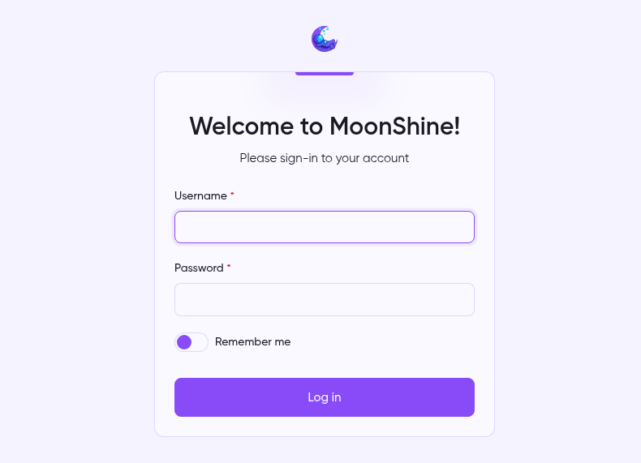

## Вход

1. Откройте `/admin`.
2. Введите **Username** и **Password** (учётные данные выдаются администратором).
3. Нажмите **Log in**.

## Выход

1. Нажмите на аватар/кнопку пользователя в правом верхнем углу.
2. Нажмите **Log out**.

# Интерфейс: как ориентироваться

## Главный экран и меню

После входа вы попадаете на Dashboard. Слева — боковое меню со всеми сущностями.

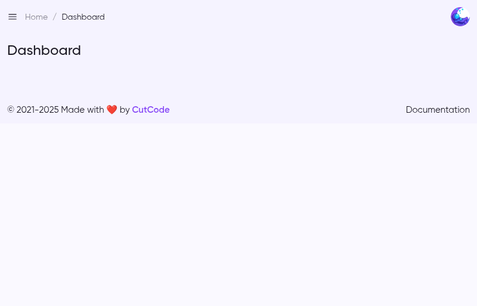

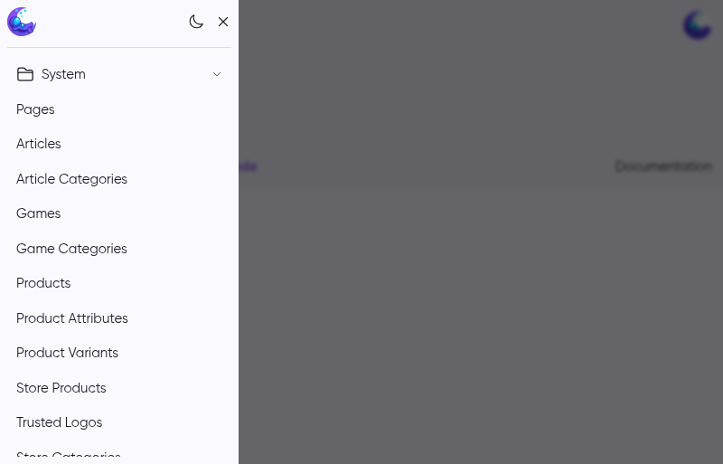

## Системный раздел (доступы)

В верхней части меню есть раздел **System**. Он отвечает за администраторов и роли (права доступа).

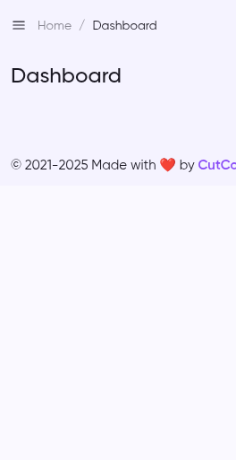

## Типовые элементы страниц

Во всех разделах MoonShine встречаются одинаковые элементы:

- **Search** — строка поиска по списку сущностей.
- **Create** — создать новую запись.
- Иконки действий в таблице:
  - просмотр (обычно «глаз»),
  - редактирование («карандаш»),
  - удаление («корзина»).
- **Save** — сохранить изменения на форме.

# Публикация и проверка изменений

## Статусы (draft/published)

Некоторые сущности (например, страницы и материалы) имеют статус. Логика обычно такая:

- **draft** — черновик, может не отображаться на сайте (или отображаться ограниченно).
- **published** — опубликовано и отображается на сайте.

Рекомендация: после сохранения всегда проверьте, что нужный статус выставлен корректно.

## Проверка результата на сайте

Практика, которая экономит время:

1. Сохраните изменения в админ‑панели (**Save**).
2. Откройте соответствующую страницу на сайте (по URL/slug).
3. Проверьте отображение (текст, картинки, порядок блоков, ссылки).

# Общие сценарии работы

## Создание записи

1. Откройте нужный раздел в меню слева.
2. Нажмите **Create**.
3. Заполните обязательные поля (обычно помечены `*`).
4. Нажмите **Save**.

## Редактирование записи

1. Откройте раздел.
2. В таблице найдите запись (по поиску/фильтрам).
3. Нажмите **Edit**.
4. Внесите изменения → **Save**.

## Удаление записи

1. Откройте раздел.
2. Нажмите иконку удаления у записи.
3. Подтвердите действие.

Рекомендация: перед удалением убедитесь, что запись нигде не используется (например, статья может быть привязана к странице или категориям).

## Загрузка изображений и файлов

Во многих сущностях есть поля типа Image/File:

- Нажмите в поле загрузки и выберите файл.
- После сохранения файл будет храниться в системе.
- Если доступна кнопка удаления (Remove), можно удалить файл из поля и сохранить запись.

## Деревья (иерархии)

Часть сущностей управляется в виде дерева (родитель → дочерние элементы). В таких разделах обычно:

- элементы можно раскрывать/сворачивать,
- порядок (position) влияет на сортировку,
- у элемента может быть Parent (родитель).

# Сущности и разделы (по меню)

Ниже приведены ключевые разделы админ‑панели и их назначение.

## Pages (Страницы)

**Назначение:** управление страницами сайта и их блоками (конструктор блоков).

**Где используется на сайте:** главная `/` и маркетинговые страницы `/{slug}` (в зависимости от типа страницы).

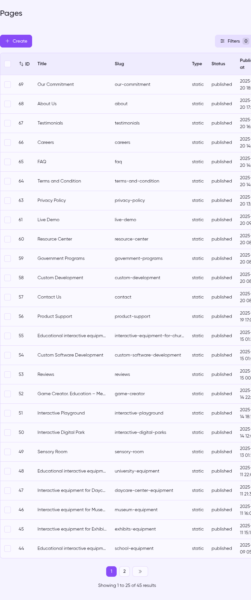

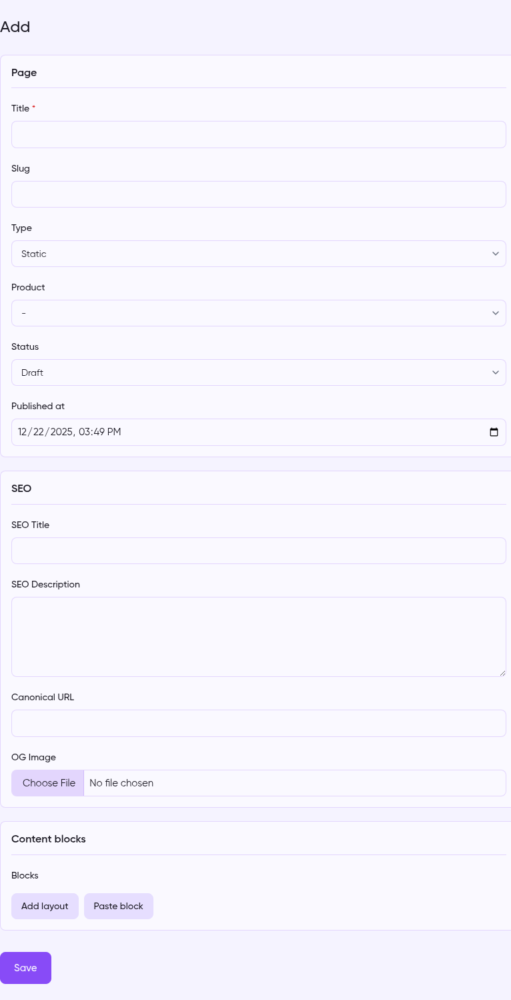

### Ключевые поля

- **Slug** — адрес страницы (например, `home` для главной).
- **Title** — заголовок страницы.
- **Type** — тип страницы (например, статическая или продуктовая).
- **Status** — черновик/публикация.
- **Blocks** — набор блоков (контент‑конструктор).
- **SEO** — мета‑поля для поисковых систем (если заполнены).

### Slug: как влияет на адрес страницы

- `slug=home` используется как главная страница сайта (`/`).
- Любой другой slug обычно соответствует адресу `/{slug}`.

Рекомендация: используйте короткие slug латиницей, без пробелов. Следите за уникальностью.

### Type: статическая vs продуктовая

Тип страницы влияет на то, какие данные и блоки участвуют в рендере:

- **Static** — обычная страница: контент полностью задаётся блоками (Blocks).
- **Product landing** — продуктовая: может быть связана с **Product** и/или формой (CTA), и на сайте дополнительно может выводиться “hero” продукта/варианты (в зависимости от конфигурации блоков).

Если страница “не выглядит как ожидалось”, проверьте:

1. правильный **Type**,
2. заполнен ли связанный **Product** (если нужен),
3. не дублируется ли hero/CTA (например, одновременно в блоках и автогенерацией).

### Работа с блоками (Blocks)

1. В блоках нажмите **Add layout** и выберите нужный блок.
2. Заполните поля блока.
3. Сохраните страницу (**Save**).

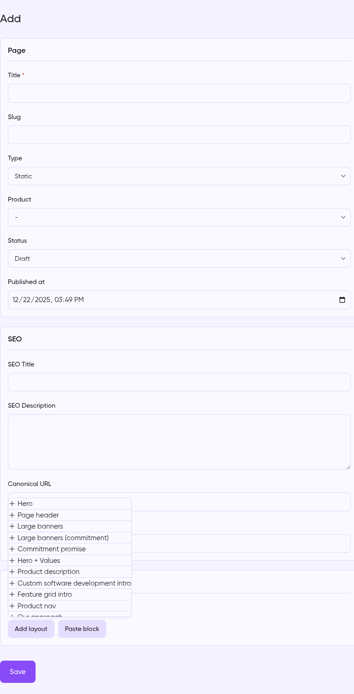

Дополнительные возможности конструктора:

- **Перетаскивание**: блоки можно менять местами (порядок влияет на отображение на сайте).
- **Copy/Paste**: у блоков может быть быстрый перенос (копирование блока и вставка на другую страницу) — удобно для повторяющихся секций.

Рекомендация: вносите изменения небольшими порциями и сразу проверяйте страницу на сайте по её `slug`.

## Articles (Новости/публикации)

**Назначение:** управление публикациями/новостями.

**Где используется на сайте:** раздел новостей (например, `/news` и страницы статей).

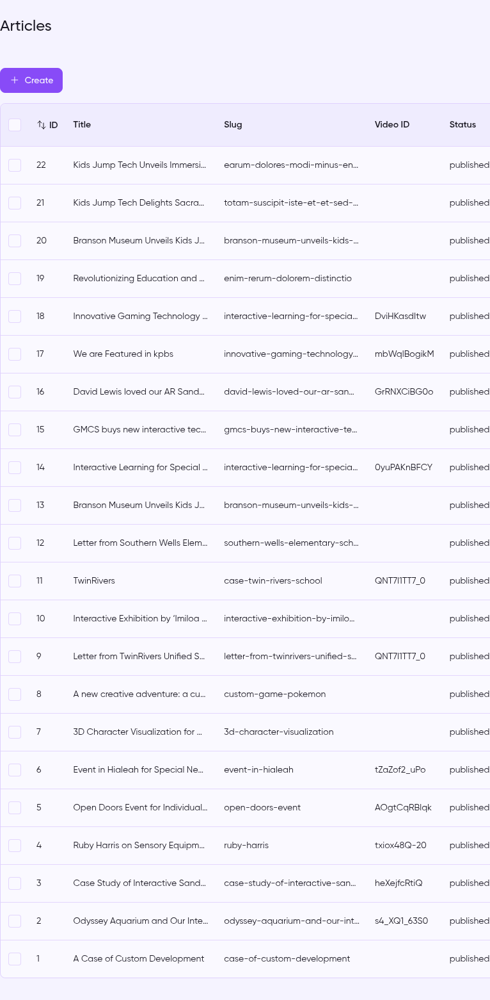

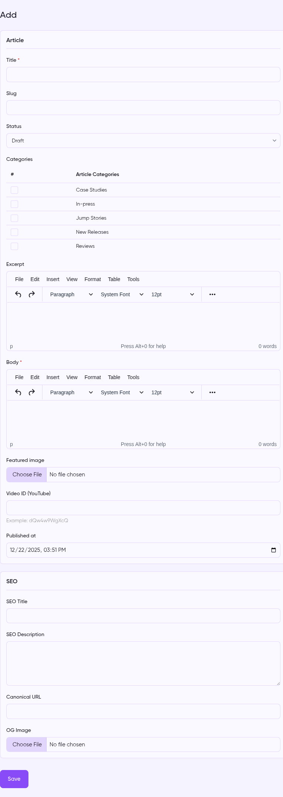

### Ключевые поля

- **Title** — заголовок.
- **Slug** — адрес статьи (часть URL).
- **Excerpt** — короткое описание (анонс).
- **Body** — основной текст (WYSIWYG‑редактор).
- **Featured image** — обложка.
- **Video ID** — если указан, на сайте может отображаться YouTube‑видео.
- **Categories** — категории статьи.
- **Status / Published at** — публикация и дата публикации.

Рекомендация: если статья не видна на сайте, проверьте статус публикации и `published_at`.

## Article Categories (Категории статей)

**Назначение:** категории для фильтрации и структуры новостей (поддерживает иерархию).

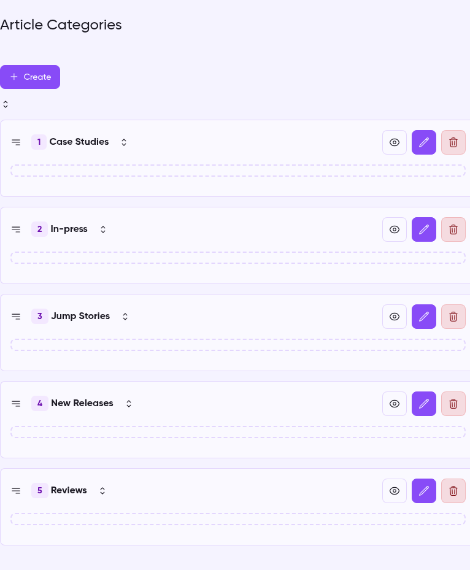

### Рекомендации

- Используйте понятные **Name** и **Slug**.
- Для вложенных категорий задавайте **Parent**.
- Порядок внутри родителя обычно задаётся через **position**.

## Games (Игры)

**Назначение:** каталог игр (карточки/описания), которые могут выводиться на страницах/лендингах.

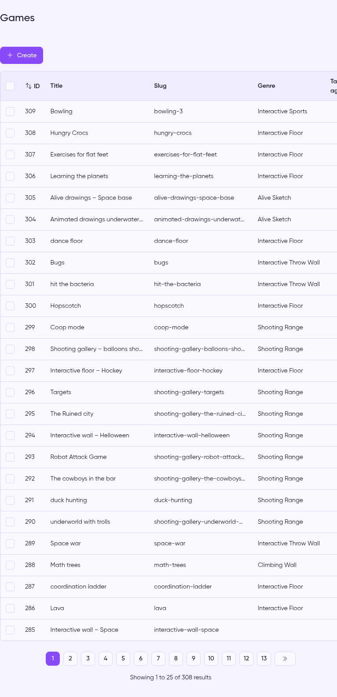

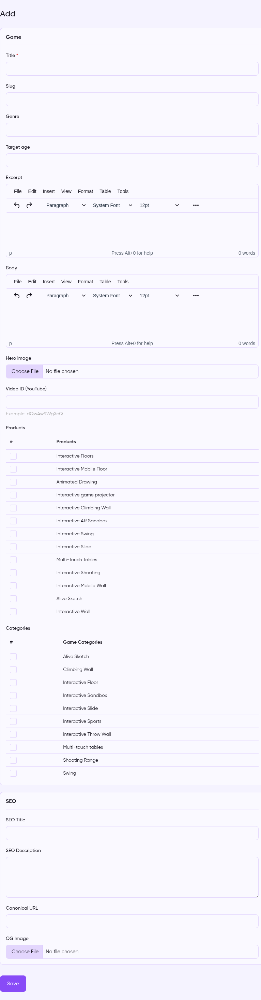

### Ключевые поля (типично)

- **Title / Slug**
- **Excerpt / Body**
- **Hero image / Video**
- **Categories** (привязка к категориям игр)

## Game Categories (Категории игр)

**Назначение:** категории для игр (используются для подборок/фильтрации).

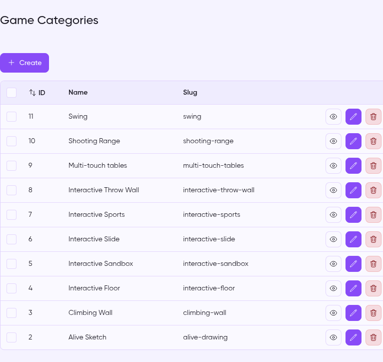

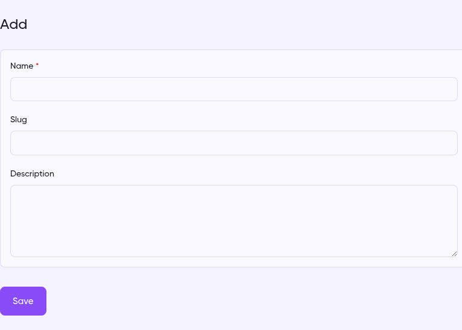

## Products (Продукты)

**Назначение:** продуктовые страницы и данные о продукте (описание, медиа, связи с вариантами и формами).

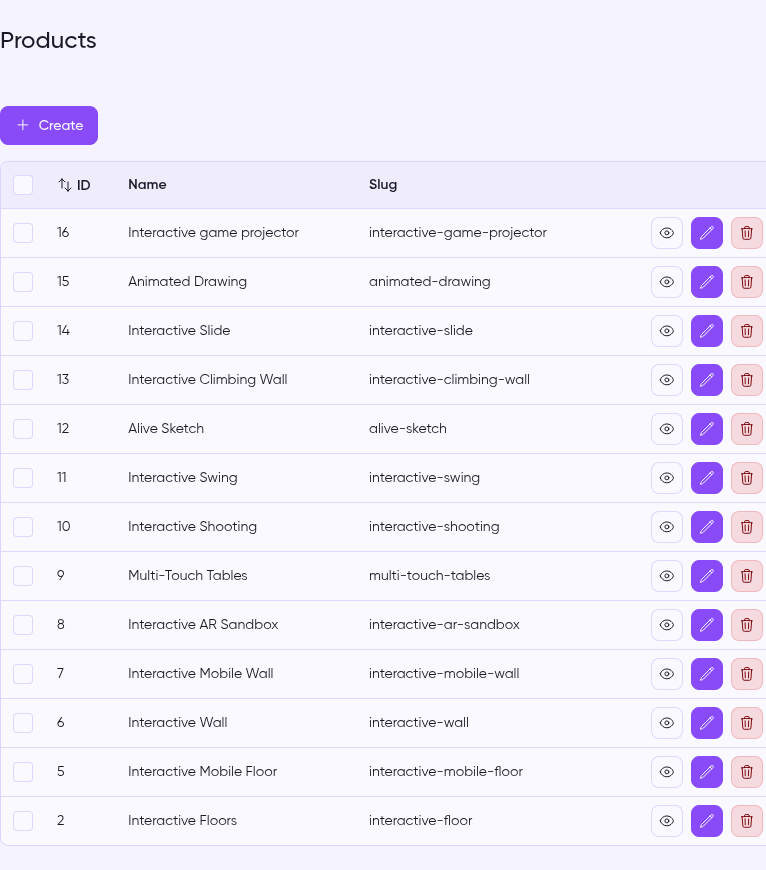

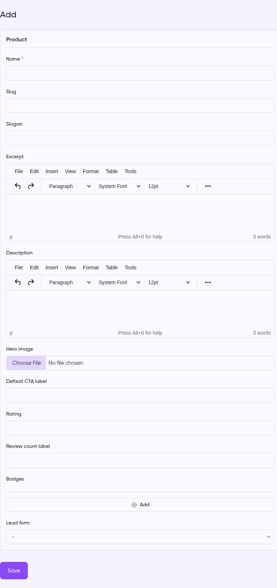

### Ключевые поля (типично)

- **Name / Slug**
- **Slogan / Excerpt / Description**
- **Hero image**
- **Form** — форма, которая открывается в CTA (например, “Get a quote”).
- **Badges** — бейджи/метки (если используются в дизайне).

### Связи и порядок

- У продукта обычно есть несколько **Product Variants** (варианты/комплектации).
- Позиция (position) у вариантов влияет на порядок вывода.

## Product Attributes (Атрибуты продукта)

**Назначение:** справочник атрибутов (характеристик), которые затем заполняются на вариантах продукта и используются в таблицах сравнения/спецификациях.

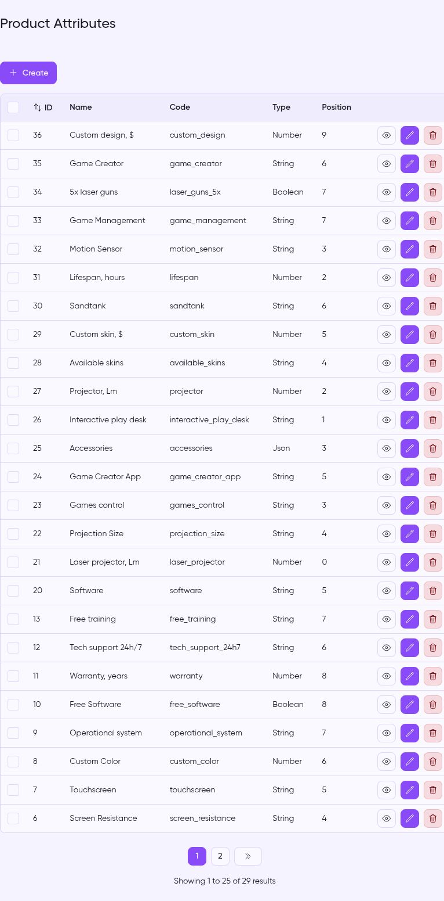

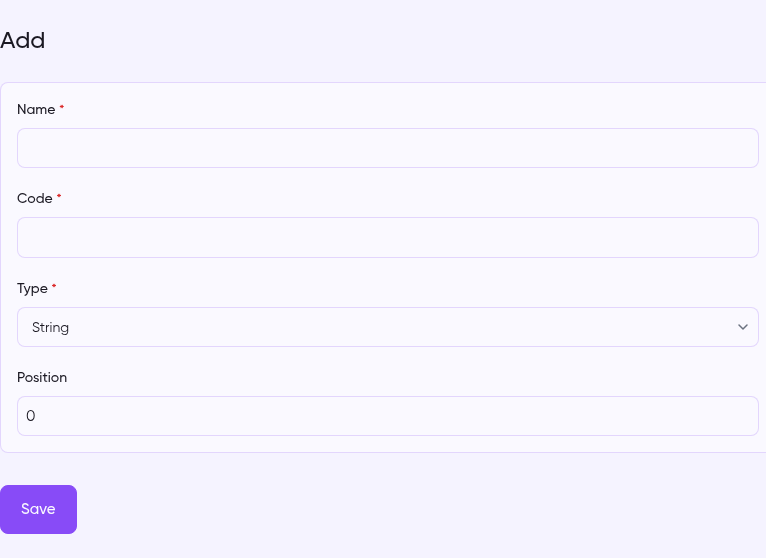

### Рекомендации

- **Type** определяет, как значение будет вводиться и отображаться (строка/число/булево/JSON).
- Если используется **code**, старайтесь делать его стабильным, т.к. он может участвовать в выводе характеристик.

## Product Variants (Варианты продукта)

**Назначение:** варианты одного продукта (например, комплектации/пакеты), с ценой, картинкой и набором атрибутов.

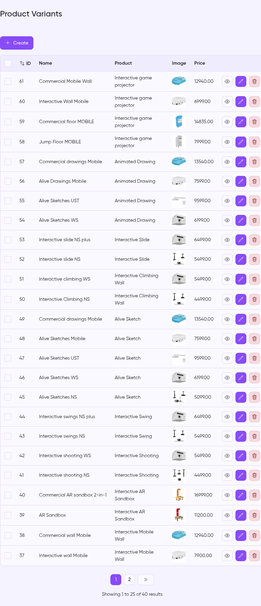

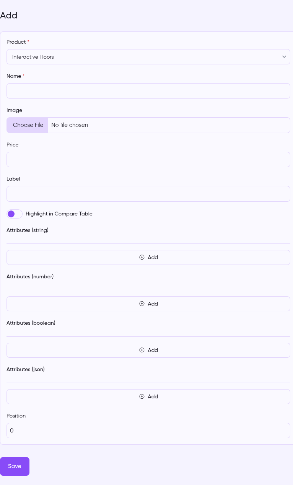

### Ключевые поля

- **Product** — к какому продукту относится вариант.
- **Name** — название варианта.
- **Image** — изображение.
- **Price** — цена (если используется).
- **Label** — короткая подпись/бейдж.
- **Highlight in Compare Table** — выделить вариант в таблице сравнения.
- **Attributes** — значения характеристик, сгруппированные по типам (string/number/boolean/json).

Рекомендация: сначала заведите **Product Attributes**, затем заполняйте их значения на **Product Variants**.

Подсказка по JSON‑атрибутам: они часто задаются в формате key/value (например, список параметров), чтобы на сайте можно было красиво отрисовать спецификации.

## Store Products (Товары магазина)

**Назначение:** товары магазина (если на сайте есть раздел store).

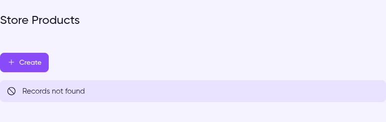

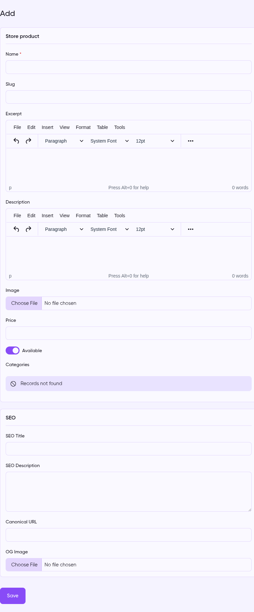

## Store Categories (Категории магазина)

**Назначение:** дерево категорий магазина (иерархия).

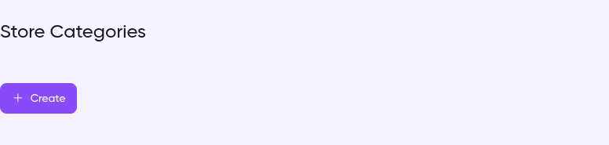

## Trusted Logos (Логотипы доверия)

**Назначение:** логотипы/знаки (например, “as seen on”, “trusted by”), которые выводятся на страницах сайта.

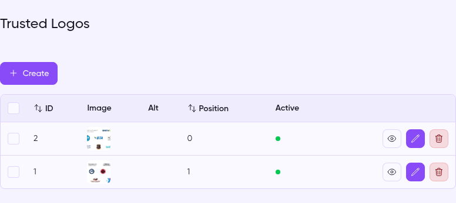

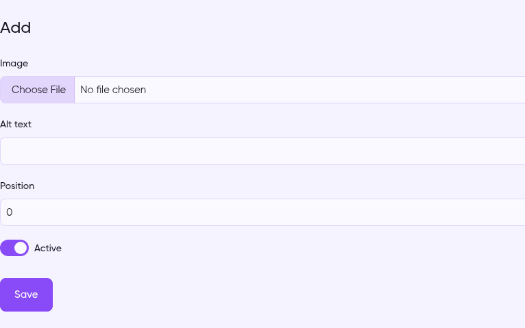

## Forms (Формы)

**Назначение:** шаблоны форм, которые используются на фронтенде (например, в модальном окне “Get a quote”). Здесь настраиваются поля, подписи, сообщения об успехе и многошаговые сценарии.

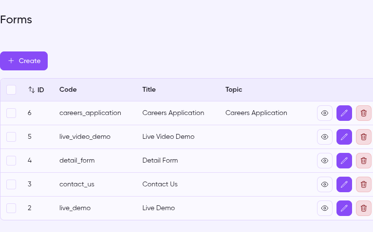

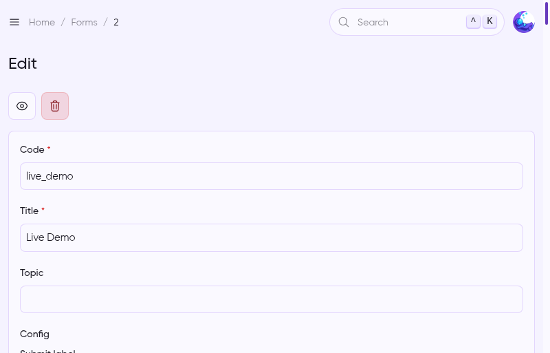

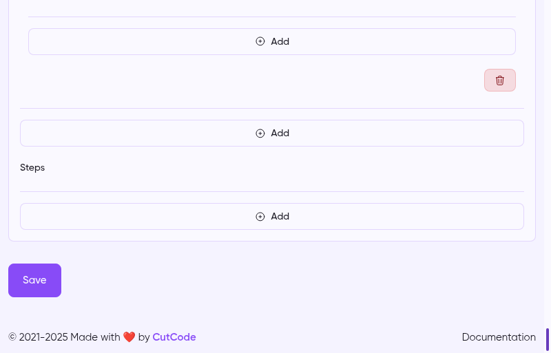

### Основные поля формы

- **Code** — уникальный код формы (используется фронтендом), например `live_demo`.
- **Title** — название формы (для админки/интерфейса).
- **Topic** — тема (может подставляться в заявки по умолчанию).

### Config → Submit label / Success message / Disclaimer

- **Submit label** — текст на кнопке отправки.
- **Success message** — сообщение после успешной отправки.
- **Disclaimer** — текст под формой (политика/согласие и т.п.).

### Config → Fields

Каждое поле формы задаётся строкой в **Fields**:

- **Name** — системное имя (ключ).
- **Label** — подпись для пользователя.
- **Type** — тип поля (`text`, `email`, `phone`, `date`, `file`, `textarea`, `select`, `checkbox`, `radio`).
- **Required** — обязательность.
- **Placeholder** — подсказка внутри поля.
- **Options** — варианты для `select/checkbox/radio` (Value/Label).

Важно про Options:

- **Value** — то, что будет сохранено в заявку (payload).
- **Label** — то, что увидит пользователь.

Практика: делайте `Value` коротким и стабильным (латиница/underscores), а `Label` — человеческим.

### Config → Steps (многошаговая форма)

Если заполнены **Steps**, форма становится многошаговой:

- у каждого шага есть заголовок и подписи кнопок “Next/Previous”,
- у каждого шага есть собственный набор полей.

Рекомендация: если делаете многошаговую форму, поддерживайте логику “от простого к сложному”: на первом шаге — контактные данные, далее — уточняющие вопросы.

### Поля типа file и date (важные нюансы)

- **file**: при отправке формы файлы сохраняются и доступны в заявке (Leads) как вложения/превью.
- **date**: на стороне сайта значения дат обычно передаются в формате `YYYY-MM-DD`.

## Leads (Заявки)

**Назначение:** все отправленные пользователями формы (заявки). Здесь администратор видит, когда и откуда пришла заявка, какие поля были заполнены, и какие файлы прикреплены.

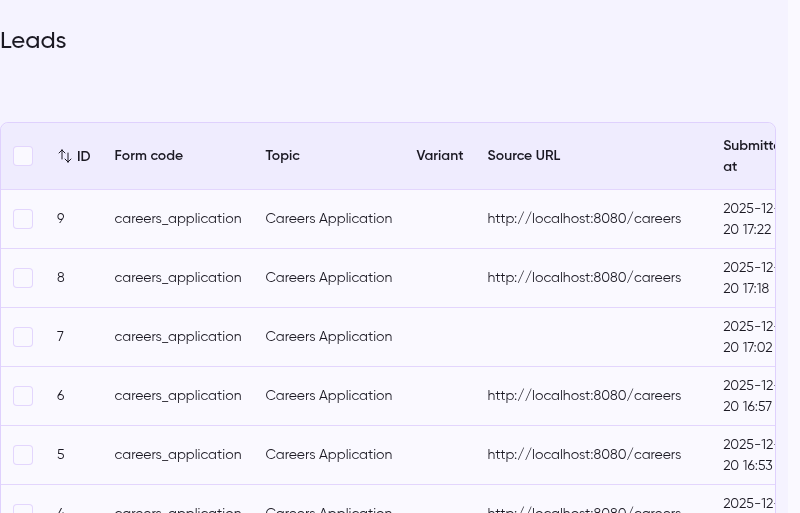

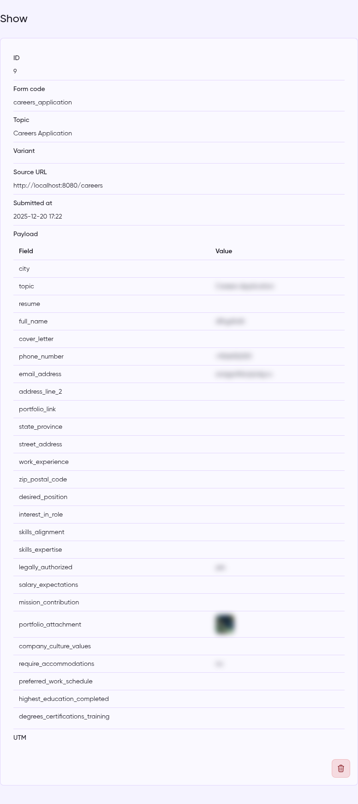

### Что смотреть в заявке

- **Form code** — по какой форме отправлено.
- **Topic** — тема заявки.
- **Source URL** — страница, с которой отправили форму.
- **Submitted at** — дата/время.
- **Payload** — значения полей (ключ → значение).
- **UTM** — маркетинговые метки (если были).

### Вложения

Если в форме есть `file`‑поля, в Payload могут отображаться:

- превью изображений,
- ссылки на скачивание файлов.

### Персональные данные

Раздел Leads обычно содержит персональные данные и файлы пользователей. Рекомендации:

- ограничьте доступ к админ‑панели только ответственным сотрудникам,
- не пересылайте скриншоты/экспорты заявок в открытых каналах,
- при необходимости используйте внутренние процедуры хранения/удаления данных.

## Site settings (Настройки сайта)

**Назначение:** единые настройки, которые используются в шапке/футере и на страницах (контакты, телефоны, соцсети, логотип и др.). Обычно это “одна запись” (singleton).

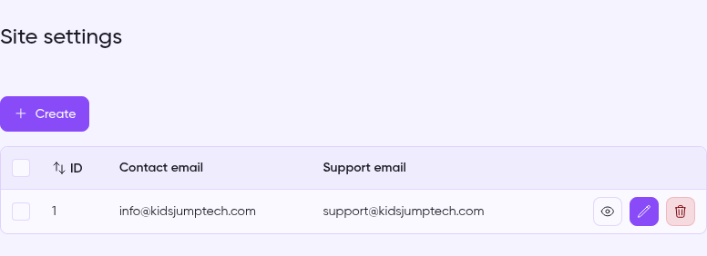

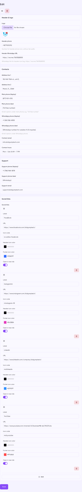

### Что обычно хранится в настройках

В этом разделе, как правило, находятся “глобальные” данные сайта:

- логотип,
- телефоны/мессенджеры в шапке,
- контакты в футере (адрес, часы работы, email),
- ссылки на соцсети.

Рекомендация: после правок в настройках проверьте шапку и футер сайта.

## Menus (Меню)

**Назначение:** список меню (например, header/footer) и их базовые параметры.

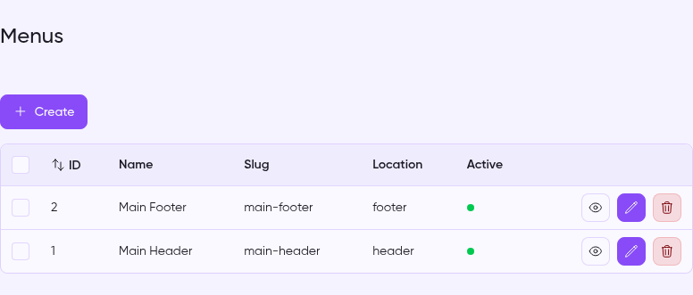

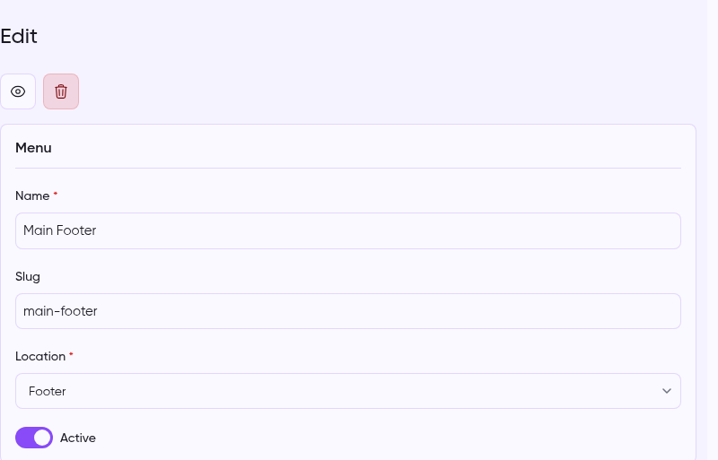

### Где используется

- `location=header` — меню для шапки,
- `location=footer` — меню для футера.

Если меню не отображается, проверьте:

- активность (is_active),
- правильную location,
- наличие пунктов (Menu Items).

## Menu Items (Пункты меню)

**Назначение:** пункты меню в виде дерева (родитель → дочерние пункты), используемые в шапке/футере.

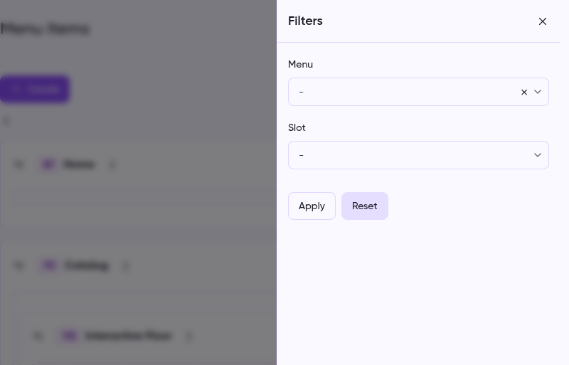

### Рекомендации

- Если у пункта меню нет URL, он может отображаться как заголовок группы.
- Проверяйте **opens in new tab** для внешних ссылок.
- Следите за **position** — он влияет на порядок.

## Reviews (Отзывы)

**Назначение:** управляемые отзывы, которые выводятся на сайте (карточки).

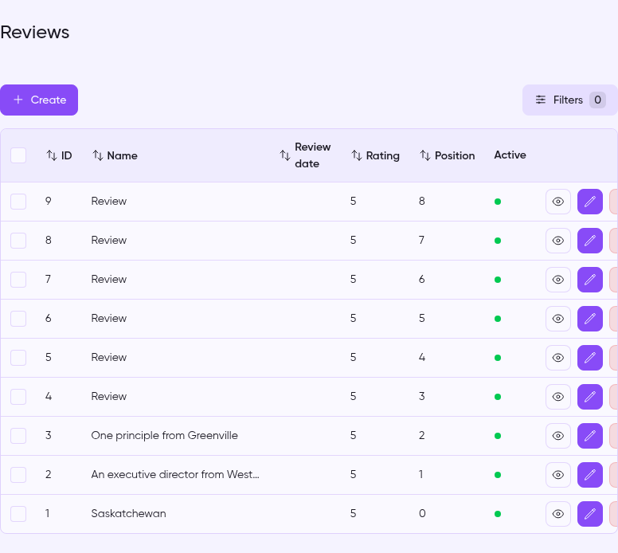

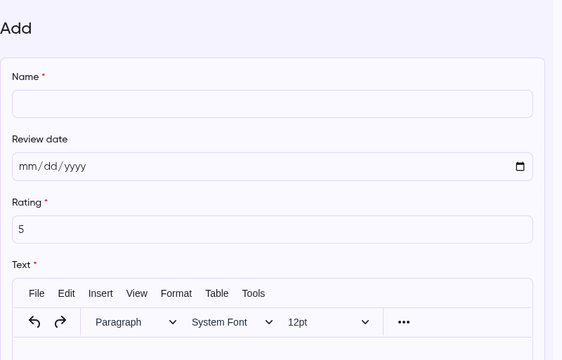

### Рекомендации

- Поддерживайте единый стиль текста (кратко, по делу).
- Следите за активностью (is_active), если отзыв временно скрывается.

## Sensory Room Bundles (Наборы)

**Назначение:** наборы (bundles), которые могут включать продукты, галерею, характеристики и кнопку CTA.

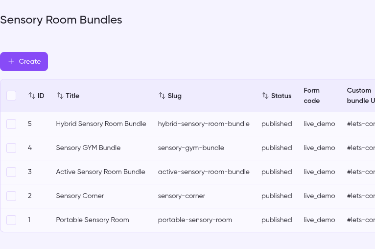

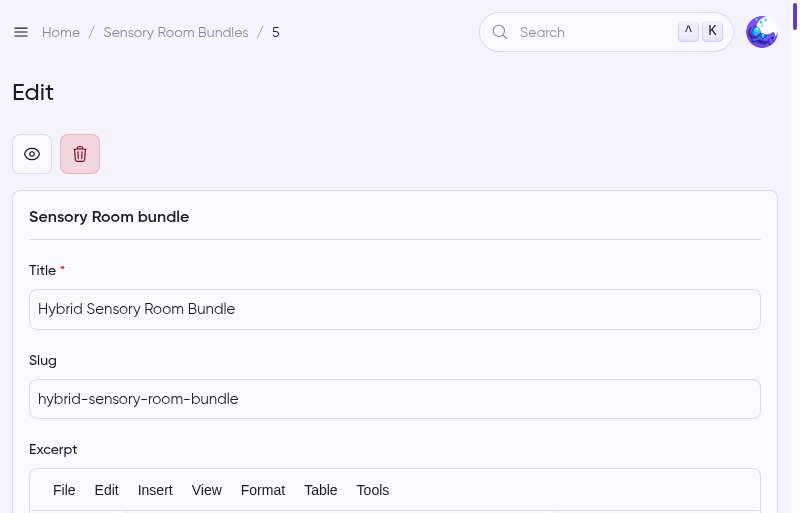

### Что важно

- **Status/position** обычно влияет на то, какие наборы и в каком порядке показаны на сайте.
- **Gallery/Specs** формируют визуальную и текстовую часть на странице набора.
- **form_code** (если есть) может использоваться для CTA‑формы на сайте.

## Team (Команда)

**Назначение:** сотрудники/участники команды, которые выводятся на сайте (если предусмотрено).

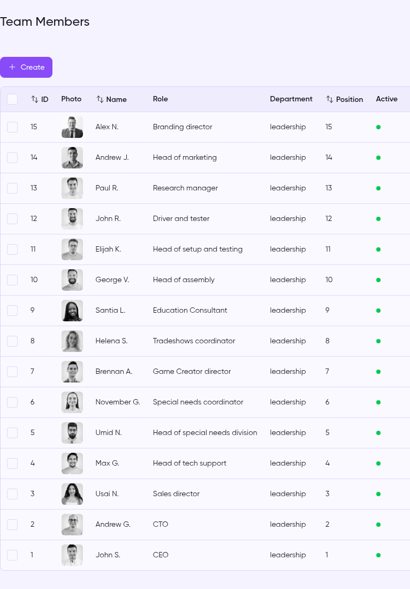

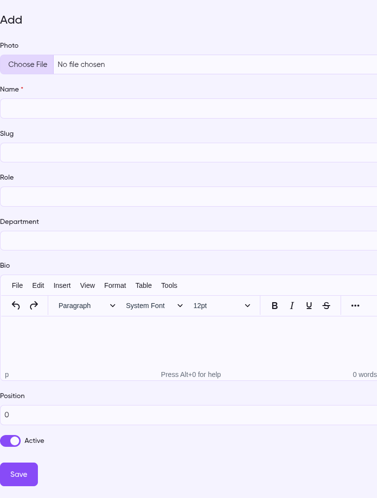

# Технические примечания (для админов/поддержки)

## Предупреждения в консоли браузера

При работе с редакторами (TinyMCE) может появляться предупреждение:

- “TinyMCE is running in evaluation mode …”

Это предупреждение про лицензионный режим редактора. Оно не мешает редактированию контента, но является техническим пунктом, который стоит учесть при выпуске в продакшн (при необходимости — настроить license key или режим GPL, в зависимости от принятой лицензии).

# System (Права доступа)

Раздел System нужен для управления доступом сотрудников к админ‑панели.

## Admins (Администраторы)

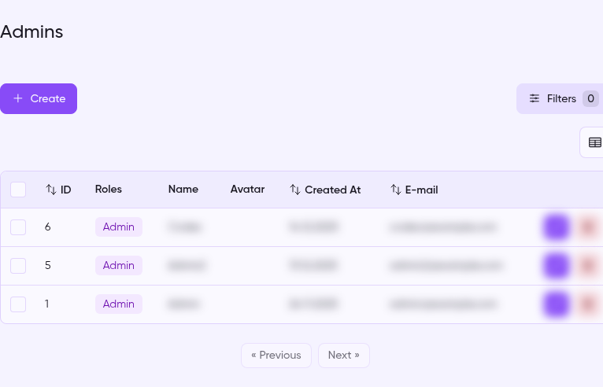

Рекомендации по безопасности:

- выдавайте доступ только тем, кому он нужен по роли,
- используйте уникальные пароли,
- при увольнении/смене обязанностей удаляйте или блокируйте аккаунты.

## Roles (Роли)

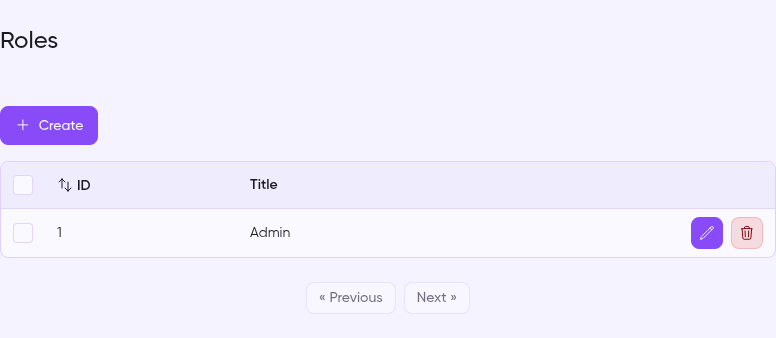

Роль определяет, какие разделы и действия доступны пользователю админ‑панели.

# Приложение: быстрый чек‑лист перед публикацией

1. Заполнили обязательные поля (`*`).
2. Сохранили (**Save**) и убедились, что страница/сущность отображается корректно.
3. Для сущностей со статусом — проверили **Status** (published).
4. Проверили страницу на сайте (в новой вкладке по URL/slug).
5. Для форм — сделали тестовую отправку и проверили появление записи в **Leads**.
